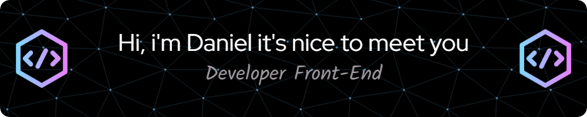

 <!-- <h1 align="center">
  Hi, i'm Daniel it's nice to meet you
  
  
</h1> -->

<!-- <h3>¡Tengo pasión por la programación y la tecnología! 🚀</h3>
<h2>Me gusta experimentar con nuevas tecnologías, crear pequeños proyectos. ✨</h2>	

 
#### Desarrollador web junior Front-End 💻 actualmente en **búsqueda activa** de empleo♨️

Desarrollador web junior full-stack 💻♨️
Actualmente me dedico a:
Reforzar conocimientos sobre el stack tecnológico MEAN y nuevas tecnologías (Vue, Python, PhP)
Colaborar en un proyecto full stack 👉🏻 duoTracker fullStack
Afianzar e investigar principios, patrones buenas prácticas y metodologías de desarrollo
Trabajando en Santander Global Tech como desarrollador Full Stack, principalmente en la parte front

#### Tengo conocimientos sobre:

##### Programming languages

  
  

  

 <a href="https://developer.mozilla.org/en-US/docs/Web/JavaScript" target="_blank">  

 -->

<!-- 

 -->

<!--  -->

<!-- I am a versatilist and easily adapt to different hats (Full Stack Web Developer 🌐, App Developer 📱, ML Engineer 🤖 or beginner level Designer 🎨) depending on what the project requires. I love exploring new tech stack 💻 and leveraging them to build cool stuffs 🛠️. -->

<!--
**DanielFigueroaDuran/DanielFigueroaDuran** is a ✨ _special_ ✨ repository because its `README.md` (this file) appears on your GitHub profile.

Here are some ideas to get you started:

- 🔭 I’m currently working on ...
- 🌱 I’m currently learning ...
- 👯 I’m looking to collaborate on ...
- 🤔 I’m looking for help with ...
- 💬 Ask me about ...
- 📫 How to reach me: ...
- 😄 Pronouns: ...
- ⚡ Fun fact: ...
-->
