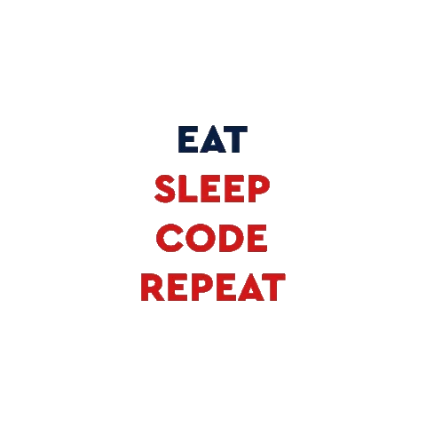

    <h2 align="center">Gracias por tomarse el tiempo de ver mi perfil de GitHub  😄</h2>
    

        <h2>👨🏻‍💻  Acerca de mí </h2>
    

🌱 Actualmente me dedico a: Reforzar conocimientos de     tecnologías e investigar principios, patrones buenas prácticas y metodologías de desarrollo.✨     

 💡 Me gusta explorar nuevas tecnologías y desarrollar soluciones de software y trucos rápidos. 

 💬 No dudes en comunicarte conmigo para realizar consultoría y voluntariado, o simplemente para tener una discusión interesante. ¡Estoy abierto a comentarios y sugerencias!
 
 ✉️ ¡Puedes enviarme un correo electrónico a figueroadurandanielelias@gmail.com ! Intentaré responder tan pronto como pueda.
 
 <figure>
  
 </figure>

<!-- width="55%" align="right"💻 -->

<!-- 

  
  
  -------

  

### 
¡Tengo pasión por la programación y la tecnología!  en **búsqueda activa** de empleo♨️

  
  

- 🔭  

  
   

## My Skill Set  
<table><tr><td valign="top" width="33%">
 

 

 
 
 

</td><td valign="top" width="33%">

</td><td valign="top" width="33%">

</td></tr></table>  

   

## Connect with me  

    
      

  

   

## Github Stats  

  

## Recent Blog Posts  
  

  

 

  

----

Generated using <a href="https://profilinator.rishav.dev/" target="_blank">Github Profilinator</a>

 -->

 <!-- <h1 align="center">
  Hi, i'm Daniel it's nice to meet you
  
  
</h1> -->

<!-- <h3>¡Tengo pasión por la programación y la tecnología! 🚀</h3>
<h2>Me gusta experimentar con nuevas tecnologías, crear pequeños proyectos. ✨</h2>	

 
--------------------------------------------

Desarrollador web junior full-stack 💻♨️
Actualmente me dedico a: Reforzar conocimientos de tecnologías e investigar principios, patrones buenas prácticas y metodologías de desarrollo.

----------------------------------------------------

#### Tengo conocimientos sobre:

##### Programming languages

  
  

  

 <a href="https://developer.mozilla.org/en-US/docs/Web/JavaScript" target="_blank">  

 -->

<!-- 

 -->

<!--  -->

<!-- I am a versatilist and easily adapt to different hats (Full Stack Web Developer 🌐, App Developer 📱, ML Engineer 🤖 or beginner level Designer 🎨) depending on what the project requires. I love exploring new tech stack 💻 and leveraging them to build cool stuffs 🛠️. -->

<!--
**DanielFigueroaDuran/DanielFigueroaDuran** is a ✨ _special_ ✨ repository because its `README.md` (this file) appears on your GitHub profile.

Here are some ideas to get you started:

- 🔭 I’m currently working on ...
- 🌱 I’m currently learning ...
- 👯 I’m looking to collaborate on ...
- 🤔 I’m looking for help with ...
- 💬 Ask me about ...
- 📫 How to reach me: ...
- 😄 Pronouns: ...
- ⚡ Fun fact: ...
-->
